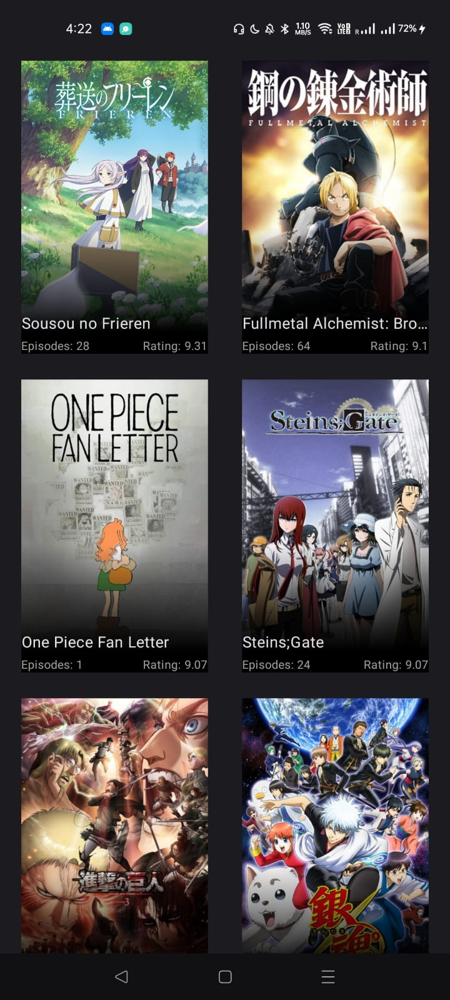

# Anime List and Detail App

## Overview

The **Anime List and Detail App** is an Android application that allows users to browse a list of anime and view detailed information about each anime. The app uses the **MVVM architecture**, **Retrofit** for API communication, **Koin** for dependency injection, **Coil** for image loading, and a **YouTube Player** for trailer playback.

## Features

- Fetches and displays a list of anime from a remote API.
- Shows detailed information about each anime, including the main cast, plot, genres, and trailer.
- Plays anime trailers using YouTubePlayer within the app.
- Loads and displays anime images using Coil.

## Tech Stack

- **Architecture**: MVVM (Model-View-ViewModel)
- **Networking**: Retrofit
- **Dependency Injection**: Koin
- **Image Loading**: Coil
- **Video Playback**: YouTube Player
- **Coroutines**: For background threading and API calls
- **Jetpack Compose**: UI components

## Project Structure

- **Model**: Represents the data models (e.g., `AnimeDetailsDto`, `AnimeCharactersDto`,`animelistDto`, etc.).
- **ViewModel**: Handles the business logic and data for the views, managing state with `flow`.
- **Repository**: Abstracts data sources such as API calls to provide data to the ViewModel.
- **Retrofit Service**: Defines API endpoints for fetching anime data.
- **Koin Modules**: Provides ViewModel, Repository, and Retrofit dependencies.

## Screens

### 1. **Anime List Screen**
Displays a list of anime fetched from a remote API.

### 2. **Anime Detail Screen**
Shows detailed information for a selected anime, including:
- Title, plot, genres, and number of episodes.
- Main cast details.
- YouTube trailer playback (if available).

## Screenshots

### Anime List Screen


### Anime Detail Screen


1. Clone the repository:
   ```bash
   git clone https://github.com/yourusername/anime-list-app.git
